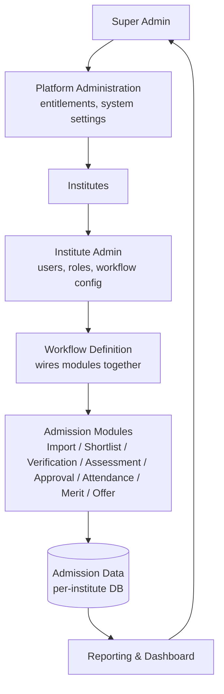
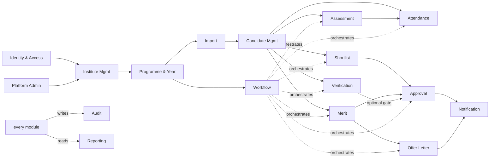

# Admission Platform — Module Architecture Document

Scope: divide the platform into production-ready domain modules (frontend + backend + DB + permissions + workflow) ahead of building a real backend. No implementation in this document.

## 0. Baseline: what the current prototype actually is

This matters because the module boundaries below are a migration from something real, not a greenfield guess.

- `index.html` (~5k lines) + `js/admission-engine.js` + `js/import-engine.js` is a **single-page, client-only app** with a homegrown template runtime (`support.js`). There is no backend and no database — persistence is one JSON blob written to a local file via the File System Access API (or `sessionStorage` for the session cookie).
- All state lives in **one flat object** (`ds`), normalized by `normalizeDataset()`: `institutes, programmes, academicYears, assessments, assessmentParams, sessions, panelists, candidates, shortlists, meritBatches, meritListReleases, approvalRequests, sentMails, panelistApprovalChain, auditLog, importConfigs, importJobs`.
- **Auth today is 3 hardcoded roles** — `super-admin`, `institute` (one role per institute, no custom roles), `panelist` — matched against plaintext credentials embedded in the dataset. There is no RBAC/permission system yet; this document's Identity module is a real addition, not a lift-and-shift.
- **Workflow sequence is hardcoded in code**, not data: `recomputeOutcome()` and the chain of engine functions encode a fixed pipeline (Import → Shortlist → Approval → Verification → Assessment → Scoring → Attendance → Merit → Approval → Release). Making this configurable is the single biggest structural change in this proposal.
- Two things in the current code are **already built the way this document recommends**, and should be treated as reference implementations, not rewrites:
  - **Approval is already generic.** `createApprovalRequest(ds, { subjectType, subjectId, ... })` and the chain-length-agnostic `approvals[i]` array shape are already subject-agnostic — shortlist approval, merit approval, and panelist approval all reuse it. The Approval module below formalizes this existing pattern.
  - **Import is already a generic engine**, not a CSV special-case: `js/import-engine.js` has a `SOURCE_TYPES` extension point, a `DataSource` abstraction, linear-chain joins, DNF (OR-of-AND) filters, a fixed transform-picker library, per-row lineage, and versioned reusable `importConfigs`. The backend Import module described below is this same design moved server-side with more connector types — not a redesign.
- `candidates` today already **merges candidate identity and candidate admission** into one record keyed by `(programmeId, academicYearId)` — a candidate re-applying to a second programme/year is not a modeled case. Splitting these (per the brief) is a deliberate change from current behavior, flagged in §K.
- There is **no Offer Letter concept today.** The closest analog is `releaseMeritBatch` / `releaseFromWaitingList`, which flips a status field — there's no generated letter, template, or candidate-facing delivery. Offer Letter is treated below as new scope, kept intentionally small.

---

## A. Platform architecture diagram



Hierarchy in words: `SUPER_ADMIN` creates institutes and grants module entitlements → `INSTITUTE_ADMIN` creates users/custom roles and configures a `Workflow` by wiring together instances of the platform's fixed module catalog → candidates flow through that workflow, producing admission data → that data rolls up into reporting, which is the one place cross-institute aggregation happens.

---

## B. Complete module list

Each module lists: Responsibility, ownership boundary, Frontend, Backend, Database, Configuration ownership, Permissions, Inputs→Processing→Outputs, Dependencies, Events.

### 1. Platform Administration
- **Responsibility:** Super-admin-only global console. Owns the catalog of installable modules and which institutes have which entitlements. Global system settings (rate limits, default password policy, platform branding, feature flags).
- **Owns:** `module_definitions`, `institute_modules`, `system_settings`, platform-level audit trail. **Does NOT own:** institute entity data itself (→ Institute Management), any admission data. **Communicates with:** every module indirectly, by gating whether an institute may use it.
- **Frontend:** Super Admin dashboard, module catalog/entitlement editor, system settings screen, cross-institute health/usage view.
- **Backend:** entitlement checks (middleware every module's API calls through: "is module X enabled for institute Y"), system settings service.
- **Database (`admission_platform`):** `module_definitions`, `institute_modules`, `system_settings`.
- **Config:** Super Admin configures all of it. Nothing here is Institute-Admin- or operator-configurable.
- **Permissions:** `platform.settings.manage`, `platform.modules.manage`, `platform.institutes.entitle`.
- **Inputs → Processing → Outputs:** Super Admin action → validate + persist → `ModuleEntitled` / `ModuleRevoked` event consumed by Institute Management's workflow-config screen (hides disabled modules).
- **Dependencies:** none (root module).
- **Events:** `ModuleEntitled`, `ModuleRevoked`, `SystemSettingChanged`.

### 2. Identity & Access Management (IAM)
- **Responsibility:** Authentication (all three login surfaces: super admin, institute-scoped staff, panelist portal), session/token issuance, Users, Roles (system roles `SUPER_ADMIN`/`INSTITUTE_ADMIN` + custom institute roles `DIRECTOR/REGISTRAR/ADMISSION_OFFICER/VERIFICATION_OFFICER/PANELIST`+ any the Institute Admin defines), and the Permission catalog.
- **Owns:** `users`, `roles`, `permissions`, credential storage, session/token lifecycle. **Does NOT own:** what a permission unlocks inside another module — IAM only stores and evaluates the grant, it doesn't know what `assessment.score` *does*. **Communicates with:** every module, via a permission-check call (`can(userId, "assessment.score", scope)`).
- **Frontend:** login (3 surfaces, matches current UI), user management, role editor (create custom role, assign permission set), "my profile"/password change.
- **Backend:** auth service (login, session/JWT issuance, panelist credential issuance mirroring today's `savePanelist` auto-generated login), RBAC evaluation service, password/credential management.
- **Database:** platform-level `users` (super admin only) + per-institute `institute_INSTxxx.users`, `roles`, `permission_grants`. Permission *catalog* (the fixed list of `<module>.<action>` strings modules register) lives in `admission_platform.permissions` since it's platform-wide, not per-institute.
- **Config:** **Super Admin:** system role definitions, password policy. **Institute Admin:** create users, define custom roles, assign permissions to roles, optionally scope a role to specific programmes (see §K-E). **Operator:** own password, own profile.
- **Permissions:** `iam.users.manage`, `iam.roles.manage`, `iam.permissions.assign`.
- **Inputs → Processing → Outputs:** credentials in → verify → session token out. Role+permission assignment in → stored grant → every other module's authorization check reads it out.
- **Dependencies:** Institute Management (a user belongs to an institute).
- **Events:** `UserCreated`, `RoleCreated`, `PermissionsAssigned`, `UserLoggedIn`.

### 3. Institute Management
- **Responsibility:** The institute entity itself — identity, branding, contact/admin info, status (Active/Suspended), lifecycle. Created by Super Admin, day-to-day settings edited by Institute Admin.
- **Owns:** `institutes` document (name, code, status, branding, admin contact). **Does NOT own:** users (→ IAM), programmes (→ Programme module), module entitlements (→ Platform Administration). **Communicates with:** Platform Administration (entitlement check), IAM (institute admin user is created alongside the institute, matching today's auto-generated login on `createInstitute`).
- **Frontend:** Super Admin's institute list/create/suspend screens; Institute Admin's own "Institute Settings" page.
- **Backend:** institute lifecycle service (create → provisions institute admin user + institute DB; suspend/reactivate).
- **Database:** `admission_platform.institutes` (directory record); the *provisioning* of an `institute_INSTxxx` database is a side effect of institute creation, not this module's data per se.
- **Config:** **Super Admin:** create/suspend, assign code. **Institute Admin:** name/branding/contact details.
- **Permissions:** `institute.create` (super admin only), `institute.manage` (own institute, institute admin).
- **Inputs → Processing → Outputs:** Super Admin submits institute form → institute record created + admin user provisioned (via IAM) + tenant DB provisioned → `InstituteCreated`.
- **Dependencies:** Platform Administration (must exist to be entitled).
- **Events:** `InstituteCreated`, `InstituteSuspended`, `InstituteReactivated`.

### 4. Programme & Academic Year Management
- **Responsibility:** Programme entity (name, code, description, fee config) and Academic Year entity, and the active-year-per-programme pointer. This is the scoping unit every admission-cycle module hangs data off of.
- **Owns:** `programmes`, `academic_years`. **Does NOT own:** required-documents list (→ Document Verification config), approval chain definition (→ Approval config), shortlist ranking rule (→ Shortlisting config) — see the note below on why these move out of the programme document. **Communicates with:** every admission module, which all take `(programmeId, academicYearId)` as scope keys.
- **Frontend:** programme list/create, academic year create/activate, programme fee-config screen.
- **Backend:** CRUD + uniqueness enforcement (`(instituteId, code)` unique; `(programmeId, yearLabel)` unique — real entity IDs, not composite `_id`s, per the brief).
- **Database:** `programmes`, `academic_years`, `active_academic_year_by_programme`.
- **Recommended change from prototype:** today `requiredDocuments`, `approvalChain`, and `shortlistRankField` are nested fields inside the `programmes` document. Recommend moving each into its owning module's own config collection, keyed by `(programmeId, academicYearId)`. Reason: the programme document otherwise becomes a dumping ground every module writes into, blocks independent versioning of each config, and risks write contention as more modules attach config.
- **Config:** **Institute Admin:** create programmes/years, set fees, activate a year.
- **Permissions:** `programme.manage`, `academicyear.manage`.
- **Inputs → Processing → Outputs:** admin form → validated + persisted → scope key available to every downstream module.
- **Dependencies:** Institute Management.
- **Events:** `ProgrammeCreated`, `AcademicYearActivated`.

### 5. Workflow Management
- **Responsibility:** The engine that lets an Institute Admin wire the fixed module catalog into an institute-specific, per-programme admission sequence — including branching (`SHORTLIST → APPROVED → ASSESSMENT`, `REJECTED → END`), not just a numeric order. Tracks each candidate admission's current position in that graph.
- **Owns:** `workflows`, `workflow_versions`, `workflow_steps` (each step = a module capability type + that module's own config-id reference, e.g. `{type: "APPROVAL", configId: "..."}`), `workflow_transitions` (edges keyed by a step's *outcome*, e.g. `approved`/`rejected`, not a bare sequence number), `workflow_instances` (per-candidate-admission current step + history). **Does NOT own:** what happens *inside* a step — Workflow decides *when* Assessment runs and what comes after it, never the scoring rubric or panelist-conflict logic. **Communicates with:** every admission module, by invoking its "run this step" entry point and reacting to its outcome event.
- **Frontend:** visual workflow builder (drag/connect steps, branch on outcome), workflow version history, per-candidate "where are they in the pipeline" trace view.
- **Backend:** graph validator (no orphan steps, every branch terminates), the executor (advances a `workflow_instance` on receiving a module's outcome event), version management (edit a workflow → new version; running instances keep executing on the version they started with).
- **Database:** `workflows`, `workflow_versions`, `workflow_steps`, `workflow_transitions`, `workflow_instances`.
- **Config:** **Super Admin:** which module *types* exist as pluggable step types (tied to Platform Administration's module catalog). **Institute Admin:** builds the actual graph per programme/year — step order, branches, which config (which approval chain, which assessment type) each step points at.
- **Permissions:** `workflow.design`, `workflow.publish`, `workflow.view`.
- **Inputs → Processing → Outputs:** Institute Admin builds graph → validated + versioned → published. At runtime: module outcome event in → executor advances `workflow_instance` → next step's "start" call out.
- **Dependencies:** Platform Administration (step type catalog), every admission module (as pluggable step implementations), Candidate Management (a workflow instance belongs to a candidate admission).
- **Events:** `WorkflowPublished`, `WorkflowInstanceAdvanced`, `WorkflowInstanceCompleted`.
- **Scope note:** kept deliberately to a DAG with outcome-keyed branching, no parallel fan-out/join. See §K-D — none of the described admission processes need concurrent branches, and adding that now would be exactly the "unnecessarily complicated" engine the brief warns against.

### 6. Data Import & Integration
- **Responsibility:** Generic multi-source data-integration engine — the backend counterpart to today's `js/import-engine.js`. Ingests one or more datasets (CSV today; connector-extensible), lets the operator map/join/filter/transform them, and commits a final candidate dataset with full lineage.
- **Owns:** `import_configs` (reusable, versioned mapping/join/filter/transform definitions), `import_jobs` (a run of a config, or an ad hoc one-off), `import_datasets` (staged raw uploads, pre-commit). **Does NOT own:** the committed `candidates`/`candidate_admissions` records themselves once committed (→ Candidate Management) — Import produces them, Candidate Management owns them after commit. **Communicates with:** Candidate Management (commit target), Workflow (an import job can be a workflow's entry step).
- **Frontend:** the existing 6-step import wizard (source select → schema inspect → join/map → filter → preview → commit), config library (save/reuse/version), per-candidate lineage viewer.
- **Backend:** `DataSource` connectors (CSV now; the `SOURCE_TYPES` map is the extension point for Mongo/API/Excel/SQL later — do not touch the join/filter/transform/commit core to add one), join engine (linear chain, inner/left/right/outer, composite keys — not an arbitrary join DAG), DNF filter engine (OR-of-AND groups, not free-form nested trees), fixed transform-picker library (trim/case/parseNumber/parseDate/formatDate/valueMap/concat/splitExtract/calc/conditional — no formula language), duplicate/unmatched-record handling, preview builder, commit service, lineage writer.
- **Database:** `import_configs`, `import_jobs`, `import_datasets`. Lineage (`job + dataset + raw-row-index`) is written onto the committed `candidate_admission` record, matching today's `importLineage` field — not a separate lineage collection, since it has no independent lifecycle from the candidate it describes.
- **Config:** **Institute Admin:** who may create/run import configs (via IAM permission), which connectors are available (tied to entitlement). **Operator (Admission Officer):** builds/reuses the actual mapping/join/filter config, runs jobs, previews, commits.
- **Permissions:** `import.configure`, `import.run`, `import.commit`, `import.view`.
- **Inputs → Processing → Outputs:** raw datasets in (per source type) → schema inspect → join/map/filter/transform → preview → commit → `candidate_admissions` created + lineage attached, out.
- **Dependencies:** Programme & Academic Year (import target scope), Candidate Management (commit target).
- **Events:** `ImportJobCompleted`, `CandidateBatchCommitted`.
- **Explicitly not further subdivided:** Schema Discovery, Join/Merge, Transform, Filter, Dedup, Preview, Lineage stay as internal services of one Import module, not separate modules — they have no independent permission model, no independent frontend surface, and always change together. Only Data Source connector *type* is a genuine extension point, already modeled as one (`SOURCE_TYPES`).

### 7. Candidate Management
- **Responsibility:** Owns two distinct entities per the brief: **Candidate** (the person/application identity) and **Candidate Admission** (that person's journey through one institute+programme+academic year+workflow). One module owns both because every other admission module operates on Candidate Admission and needs a single, non-circular owner.
- **Owns:** `candidates`, `candidate_admissions`. **Does NOT own:** shortlist/verification/assessment/merit/offer *state* beyond a denormalized status summary for list views — the module records "this candidate admission is at workflow step X with status Y," it does not compute that status (each owning module writes it via its own event). **Communicates with:** every admission module (they all key off `candidateAdmissionId`), Workflow (holds the `workflow_instance` pointer), Import (commit target).
- **Frontend:** candidate list/search/filter, candidate profile (identity + all admissions), candidate admission detail (per-cycle status trace).
- **Backend:** candidate identity dedup-on-import (same person applying to a second programme/year should link to the existing `candidate` record, not create a duplicate identity), admission lifecycle CRUD.
- **Database:** `candidates` (institute-scoped identity — see §K-B on why not platform-scoped), `candidate_admissions` (references `candidateId, programmeId, academicYearId, workflowInstanceId`).
- **Config:** **Institute Admin:** which fields are required on a candidate profile (beyond the platform's fixed core fields) — this is intentionally minimal; field-level customization lives in Import's field-mapping step, not here.
- **Permissions:** `candidate.view`, `candidate.manage`, `candidate.admission.view`.
- **Inputs → Processing → Outputs:** Import commit in → candidate + admission records out; every downstream module writes status updates onto the admission record.
- **Dependencies:** Programme & Academic Year, Import (primary creation path), Workflow (instance pointer).
- **Events:** `CandidateCreated`, `CandidateAdmissionCreated`, `CandidateAdmissionStatusChanged`.

### 8. Shortlisting
- **Responsibility:** Rank/filter candidate admissions against a criterion (rank field + threshold, matching today's `confirmShortlist`) and produce a shortlist list that then goes through Approval.
- **Owns:** `shortlists` (criteria, membership, resulting list). **Does NOT own:** the approval of that list (→ Approval module — Shortlisting only *requests* approval on its output). **Communicates with:** Candidate Management (source pool + status writeback), Approval (submits the list as an approval subject).
- **Frontend:** shortlist builder (pick criterion/threshold), shortlist review/detail screen.
- **Backend:** ranking/filter service.
- **Database:** `shortlists`.
- **Config:** **Institute Admin:** which candidate field(s) may be used as a rank criterion (today: `shortlistRankField` on the programme — recommend moving to a Shortlisting-owned per-programme config doc, see §4).
- **Permissions:** `shortlist.create`, `shortlist.view`.
- **Inputs → Processing → Outputs:** candidate pool + criterion in → ranked/filtered list out → submitted to Approval.
- **Dependencies:** Candidate Management, Approval.
- **Events:** `ShortlistCreated`, `CandidateShortlisted`.

### 9. Document Verification
- **Responsibility:** Category/DA/other required-document upload and per-document verification status, matching today's `setVerification`.
- **Owns:** required-document *definitions* per programme (moved here from the programme document, see §4) and per-candidate-admission verification status. Recommend keeping verification status **embedded on `candidate_admissions`** (today's shape), not a standalone `verifications` collection — it's always read/written together with the admission record and has no independent query pattern, so a join buys nothing. This is a deliberate override of the suggested top-level `verifications` collection.
- **Does NOT own:** the approval that may gate on verification completeness (→ Approval, if a workflow wires it that way). **Communicates with:** Candidate Management (writes onto its record), Approval (optional gate).
- **Frontend:** required-document config screen, candidate document upload, verification review queue.
- **Backend:** document status service, completeness check (`verificationComplete`, matching today).
- **Database:** `required_documents` (per programme, own collection — moved out of `programmes`), verification status embedded in `candidate_admissions.verification.documents`.
- **Config:** **Institute Admin:** which documents are required, per programme/category.
- **Permissions:** `verification.configure`, `verification.review`, `verification.view`.
- **Inputs → Processing → Outputs:** uploaded documents in → status set per document → completeness flag out.
- **Dependencies:** Programme & Academic Year, Candidate Management.
- **Events:** `DocumentVerified`, `VerificationCompleted`.

### 10. Assessment
- **Responsibility:** Assessment type/rubric configuration (PI/GE/WAT/WE-style, per programme) **and** execution — sessions, groups, candidate allocation, panelist assignment (with conflict checking), scoring, and score locking. Kept as **one** module, not split into "Configuration" vs "Execution/Panelist" as the suggestion list implies — they share the same rubric/session/score schema today and always change together; splitting would add a dependency edge with no isolation benefit.
- **Owns:** assessment type/rubric config, sessions/groups, allocation, panelist-session assignment, scores. **Does NOT own:** the panelist's *user account* (→ IAM issues panelist login credentials, matching today's auto-generated credentials on `savePanelist`) — Assessment owns only the execution-time scheduling/scoring data tied to that account. **Communicates with:** IAM (panelist identity), Candidate Management (who's being assessed), Workflow (when it runs).
- **Frontend:** rubric/parameter config screen, session/group scheduling, allocation UI, panelist assignment + zoom-room UI, panelist scoring portal, score lock/review.
- **Backend:** allocation service, panelist conflict checker (`findPanelistConflict`, time-overlap check), score submission/locking service.
- **Database (recommended change from prototype):** `assessment_types`, `assessment_parameters` (per programme), `assessment_sessions` (sessions+groups), and **`assessment_scores` as its own collection** (`candidateAdmissionId, assessmentId, panelistId, scores, notes, locked`) — *not* embedded in the candidate record as today (`piScores/piNotes/piScoreLocked` maps). Reason: an embedded map means every panelist's score write serializes against the whole candidate document (MongoDB locks at document granularity), and there's no way to query/export "all of panelist X's scores" without scanning every candidate. Splitting it out removes both problems.
- **Config:** **Institute Admin:** rubric/parameters, session windows. **Operator (Admission Officer):** scheduling, allocation, panelist assignment. **Operator (Panelist):** score entry (own scope only).
- **Permissions:** `assessment.configure`, `assessment.schedule`, `assessment.allocate`, `assessment.score`, `assessment.score.lock`, `assessment.view`.
- **Inputs → Processing → Outputs:** candidate pool + session config in → allocation + panelist assignment → scores in → locked score out.
- **Dependencies:** Candidate Management, IAM (panelist accounts), Programme & Academic Year.
- **Events:** `SessionScheduled`, `CandidateAllocated`, `PanelistAssigned`, `AssessmentScored`, `AssessmentScoreLocked`.

### 11. Approval
- **Responsibility:** Generic, subject-agnostic multi-level approval chain — already the right shape in the current code (`createApprovalRequest(ds, {subjectType, subjectId, ...})`, chain-length-agnostic `approvals[i]`). Reused by Shortlisting, Merit, Document Verification (optionally), and Panelist onboarding. Owns the *decision* (approve/reject at each level) — not the *notification channel* used to solicit that decision (see Notification module below, which is a split from today's code where OTP-mail approval is embedded directly in the approval functions).
- **Owns:** `approval_chains` (definition, per subject type, per programme — moved out of `programmes.approvalChain`), `approval_requests` (a running instance against one subject). **Does NOT own:** the mail/OTP delivery mechanism (→ Notification), or what happens after final approval (→ Workflow decides the next step). **Communicates with:** every module that needs a gate (Shortlisting, Merit, Verification, Panelist onboarding), Notification (delivery), Workflow (outcome event).
- **Frontend:** approval chain config screen, approval inbox/action screen (approve/reject + comments), approval history.
- **Backend:** chain executor (advance to next level on approve, terminate on reject), subject-type registry (which subject types exist — a small fixed enum: shortlist, merit-batch, verification, panelist).
- **Database:** `approval_chains`, `approval_requests`.
- **Config:** **Institute Admin:** chain definition per subject type per programme (number of levels, who approves each level).
- **Permissions:** `approval.configure`, `approval.perform`.
- **Inputs → Processing → Outputs:** subject + chain config in → level-by-level decisions → final `approved`/`rejected` out, consumed by Workflow.
- **Dependencies:** IAM (who can approve), Notification (delivery channel), Workflow (consumes outcome).
- **Events:** `ApprovalRequested`, `ApprovalGranted`, `ApprovalRejected`.

### 12. Attendance
- **Responsibility:** Mark attendance for a candidate admission at a given assessment/kind, matching today's `markAttendance`.
- **Owns:** `attendance_records`. **Does NOT own:** the session/allocation itself (→ Assessment). **Communicates with:** Assessment (which session), Candidate Management (writeback).
- **Frontend:** attendance marking screen (session roster + present/absent).
- **Backend:** attendance service.
- **Database:** `attendance_records` (`candidateAdmissionId, kind, status, date`).
- **Config:** **Institute Admin:** which attendance kinds exist per programme (e.g. exam day, interview day).
- **Permissions:** `attendance.mark`, `attendance.view`.
- **Inputs → Processing → Outputs:** roster + marks in → attendance record out.
- **Dependencies:** Candidate Management, Assessment (session context).
- **Events:** `AttendanceMarked`.

### 13. Merit Processing
- **Responsibility:** Batch merit-list computation (category/criteria/waiting-list, matching `runMeritProcessing`), approval of the resulting batch, and release (matching `releaseMeritBatch`/`releaseFromWaitingList`).
- **Owns:** `merit_batches`, `merit_results`, `merit_list_releases`. **Does NOT own:** the approval decision itself (→ Approval, as a subject type) — Merit submits a batch as an approval subject. **Communicates with:** Candidate Management (source pool + rank writeback), Approval, Offer Letter (release triggers offer generation).
- **Frontend:** merit batch builder (category/criteria/waiting-list size config), merit batch detail/approval screen, release screen.
- **Backend:** merit computation service, release service.
- **Database:** `merit_batches`, `merit_results`, `merit_list_releases`. Rank/status summary denormalized onto `candidate_admissions` for fast list rendering (matching today's approach of writing rank fields directly on the candidate).
- **Config:** **Operator (Admission Officer/Registrar):** batch criteria, waiting list size, release dates.
- **Permissions:** `merit.process`, `merit.approve` (delegates to Approval), `merit.release`, `merit.view`.
- **Inputs → Processing → Outputs:** candidate pool + criteria in → ranked batch → approved → released, out to Offer Letter.
- **Dependencies:** Candidate Management, Approval.
- **Events:** `MeritBatchGenerated`, `MeritBatchApproved`, `MeritListReleased`.

### 14. Offer Letter
- **Responsibility:** Generate and send an offer communication for a released/merit-selected candidate admission. **Genuinely new scope** — see §0 and §K-F. Kept minimal: generate a letter (template + candidate data merge), record its status, send it. Explicitly not scoped: e-signature, candidate accept/decline portal, fee-payment linkage — none of these are in the current prototype or requested module list, so none are invented here (§K-F flags them as open questions if wanted later).
- **Owns:** `offer_letters` (template reference, generated content, status, sent timestamp). **Does NOT own:** the merit decision that triggers it (→ Merit Processing), delivery mechanics (→ Notification). **Communicates with:** Merit Processing (trigger), Notification (send), Candidate Management (writeback).
- **Frontend:** offer template config, offer generation/preview screen, sent-offer status list.
- **Backend:** template-merge service, offer status service.
- **Database:** `offer_templates`, `offer_letters`.
- **Config:** **Institute Admin:** offer letter template per programme.
- **Permissions:** `offer.configure`, `offer.generate`, `offer.view`.
- **Inputs → Processing → Outputs:** released candidate admission in → template merge → generated letter → sent, out.
- **Dependencies:** Merit Processing, Notification.
- **Events:** `OfferGenerated`, `OfferSent`.

### 15. Notification & Communication *(new — not in the suggested list; added and justified below)*
- **Responsibility:** Cross-cutting mail/SMS send + template + OTP-verification service. **Split out of today's code**, where `sendApprovalMail`/`generateMailOtp`/`verifyMailOtp` live directly inside the approval functions in `admission-engine.js`. Pulling it out keeps Approval channel-agnostic (approve via a UI button today, an emailed OTP link tomorrow, SMS later, without Approval's core logic changing) and gives Offer Letter and Import (job-completion notices) a channel to reuse instead of each reimplementing mail+OTP.
- **Owns:** `message_templates`, `sent_messages` (matches today's `sentMails`), OTP issuance/verification. **Does NOT own:** *what* triggers a message (Approval/Offer/Import each decide when to call it) or the business decision an OTP unlocks. **Communicates with:** Approval, Offer Letter, Import.
- **Frontend:** sent-message log/detail (matches today's mail-compose/sent-mail screens), template config.
- **Backend:** send service (pluggable transport, email today), OTP generate/verify service.
- **Database:** `message_templates`, `sent_messages`.
- **Config:** **Institute Admin:** templates. **Super Admin:** transport/provider config (SMTP creds etc.).
- **Permissions:** `notification.send`, `notification.view`.
- **Inputs → Processing → Outputs:** trigger + template + recipient in → message sent + logged out; OTP entered in → verified/rejected out.
- **Dependencies:** none (leaf infrastructure module).
- **Events:** `MessageSent`, `OtpVerified`.

### 16. Reporting & Dashboard
- **Responsibility:** Read-only aggregation and visualization across every other module's data. Deliberately owns **no mutation state of its own** — it reads, it doesn't decide.
- **Owns:** materialized/cached report views only (if needed for performance) — never source-of-truth data. **Does NOT own:** anything another module already owns. **Communicates with:** every module, read-only.
- **Frontend:** institute dashboard, super-admin cross-institute dashboard, per-module report exports.
- **Backend:** aggregation queries per institute DB; for cross-institute Super Admin views, either app-level fan-out across tenant DBs or a change-stream-fed rollup store in `admission_platform` (see §I on the reporting-across-tenant-DBs risk).
- **Database:** reads from every module's collections; optionally an `admission_platform.reporting_rollups` collection for cross-institute aggregates.
- **Config:** **Institute Admin:** which reports/widgets appear on their dashboard.
- **Permissions:** `report.view` (scoped per module — a report should never leak data the viewer couldn't otherwise see).
- **Inputs → Processing → Outputs:** module data in → aggregated/computed → chart/export out.
- **Dependencies:** all modules (read-only).
- **Events:** none produced (pure consumer).

### 17. Audit & Activity *(cross-cutting infrastructure, already exists today as `auditLog`)*
- **Responsibility:** Append-only record of who did what, when, across the whole platform. Every module writes to it; no module reads another module's business meaning out of it — it's a log, not a queryable domain model.
- **Owns:** `audit_log` (per institute) + `audit_log_platform` (super-admin-level actions: institute creation, entitlement changes). **Does NOT own:** enforcement (it records, it doesn't gate). **Communicates with:** every module (write-only, typically via a shared logging call rather than an event bus — see §I).
- **Frontend:** audit log viewer/search (Institute Admin + Super Admin).
- **Backend:** append-only write service, retention policy.
- **Database:** `audit_log`, `admission_platform.audit_log_platform`.
- **Config:** **Super Admin:** retention period.
- **Permissions:** `audit.view`.
- **Inputs → Processing → Outputs:** action metadata in → appended, immutable, out.
- **Dependencies:** none (leaf infrastructure module).
- **Events:** none produced (it *is* the event sink).

---

## C. Module dependency graph



Read the dotted "orchestrates" edges as Workflow's actual relationship to the admission modules: it decides *when* each runs and *what follows*, never their internals — this is the module-vs-workflow-step distinction from the brief.

---

## D. Data ownership map

| Module | Database | Collections owned |
|---|---|---|
| Platform Administration | `admission_platform` | `module_definitions`, `institute_modules`, `system_settings` |
| Identity & Access | `admission_platform` (super admin users, permission catalog) + `institute_INSTxxx` | `users`, `permissions` (platform); `users`, `roles`, `permission_grants` (per institute) |
| Institute Management | `admission_platform` | `institutes` |
| Programme & Academic Year | `institute_INSTxxx` | `programmes`, `academic_years`, `active_academic_year_by_programme` |
| Workflow | `institute_INSTxxx` | `workflows`, `workflow_versions`, `workflow_steps`, `workflow_transitions`, `workflow_instances` |
| Data Import & Integration | `institute_INSTxxx` | `import_configs`, `import_jobs`, `import_datasets` |
| Candidate Management | `institute_INSTxxx` | `candidates`, `candidate_admissions` |
| Shortlisting | `institute_INSTxxx` | `shortlists` |
| Document Verification | `institute_INSTxxx` | `required_documents` (verification status embedded in `candidate_admissions`) |
| Assessment | `institute_INSTxxx` | `assessment_types`, `assessment_parameters`, `assessment_sessions`, `assessment_scores` |
| Approval | `institute_INSTxxx` | `approval_chains`, `approval_requests` |
| Attendance | `institute_INSTxxx` | `attendance_records` |
| Merit Processing | `institute_INSTxxx` | `merit_batches`, `merit_results`, `merit_list_releases` |
| Offer Letter | `institute_INSTxxx` | `offer_templates`, `offer_letters` |
| Notification | `institute_INSTxxx` | `message_templates`, `sent_messages` |
| Reporting | `admission_platform` (rollups only) | `reporting_rollups` (optional, cache only) |
| Audit & Activity | `admission_platform` + `institute_INSTxxx` | `audit_log_platform`, `audit_log` |

Changes from the brief's suggested schema, and why: `verifications` folded into `candidate_admissions` (1:1, always co-accessed, no independent lifecycle); `assessment_instances`/scores moved out of the candidate document into their own collection (write-contention + queryability); `required_documents` and `approval_chains` moved out of `programmes` into their owning modules' own config collections; `workflow_instances` and `import_datasets` added (present in the brief's narrative but missing from its collection list); `merit_list_releases` added (matches existing `ds.meritListReleases`, also missing from the brief's list).

---

## E. Configuration ownership

| Configurable item | Super Admin | Institute Admin | Role config | Workflow config | Module operator |
|---|---|---|---|---|---|
| Module catalog / entitlements | ✅ | — | — | — | — |
| System settings (branding, transport) | ✅ | — | — | — | — |
| Institute lifecycle (create/suspend) | ✅ | — | — | — | — |
| Institute branding/contact | — | ✅ | — | — | — |
| Users, custom roles, permission assignment | — | ✅ | ✅ (defines what a role can do) | — | — |
| Programmes, academic years, fees | — | ✅ | — | — | — |
| Workflow graph (steps, branches, versions) | — | ✅ | — | ✅ (this *is* the config) | — |
| Import source connectors available | ✅ (entitlement) | — | — | — | — |
| Import mapping/join/filter/transform config | — | — | — | — | ✅ (Admission Officer) |
| Required documents per programme | — | ✅ | — | — | — |
| Shortlist rank criterion | — | ✅ | — | — | — |
| Assessment rubric/parameters | — | ✅ | — | — | — |
| Session scheduling, allocation, panelist assignment | — | — | — | — | ✅ (Admission Officer) |
| Score entry | — | — | — | — | ✅ (Panelist, own scope) |
| Approval chain definition per subject type | — | ✅ | — | — | — |
| Approval decisions | — | — | — | — | ✅ (per configured level) |
| Merit batch criteria / waiting-list size | — | — | — | — | ✅ (Registrar/Admission Officer) |
| Offer letter template | — | ✅ | — | — | — |
| Message templates | — | ✅ | — | — | — |
| Audit retention | ✅ | — | — | — | — |

---

## F. Frontend module structure

```text
src/
├── modules/
│   ├── platform/            # super-admin console: entitlements, system settings
│   ├── auth/                # 3-surface login, session handling
│   ├── users/                # user CRUD (institute-scoped)
│   ├── roles/                # custom role + permission editor
│   ├── institutes/          # institute CRUD (super admin) + institute settings (institute admin)
│   ├── programmes/          # programme + academic year
│   ├── workflows/           # workflow builder (graph editor), version history
│   ├── imports/              # 6-step import wizard, config library, lineage viewer
│   ├── candidates/          # candidate list/profile, admission detail
│   ├── shortlists/
│   ├── verification/
│   ├── assessments/          # config + scheduling + allocation + panelist scoring portal
│   ├── approvals/            # chain config + approval inbox
│   ├── attendance/
│   ├── merit/
│   ├── offers/
│   ├── notifications/        # template config + sent-message log
│   ├── reporting/            # dashboards
│   └── audit/                # audit log viewer
│
├── shared/                   # cross-module domain types (CandidateAdmission ref, PermissionGate, etc.)
├── components/                # generic UI primitives (unrelated to any one module)
├── services/                  # API client per module namespace
├── hooks/
└── routing/
```

Each `modules/<x>/` folder owns its own pages, its own API-service calls, and its own local state — no module imports another module's internal components, only its published `services/` client, matching the "owns / does not own / communicates with" boundaries in §B.

---

## G. Backend module structure (Django apps)

```text
apps/
├── platform/          # module_definitions, institute_modules, system_settings
├── authentication/    # login, session/JWT issuance for all 3 surfaces
├── identity/          # users, roles, permission catalog + evaluation
├── institutes/        # institute entity + lifecycle + tenant DB provisioning
├── programmes/        # programmes, academic_years
├── workflows/         # workflow definitions, graph validator, executor, instances
├── imports/           # DataSource connectors, join/filter/transform engine, jobs, lineage
├── candidates/        # candidate + candidate_admission
├── shortlists/
├── verification/
├── assessments/       # config + sessions + allocation + scoring
├── approvals/         # generic subject-agnostic approval chain engine
├── attendance/
├── merit/
├── offers/
├── notifications/     # send + template + OTP
├── reporting/         # cross-module read-only aggregation
└── audit/             # append-only activity log
```

Each app follows the same internal shape, only as deep as the app actually needs (a thin app like `attendance` may just be `models.py` + `views.py` + `serializers.py` — don't manufacture a `repositories/` layer for three fields):

```text
apps/<name>/
├── models.py          # or models/ if the schema genuinely has multiple aggregates
├── services.py        # business logic or an explicit dependency (workflow orchestration, approval engine)
├── serializers.py
├── views.py            # or viewsets.py
├── permissions.py      # DRF permission classes wired to the identity app's grants
└── validators.py        # only where validation is non-trivial (e.g. workflow graph validity, import filter DNF)
```

`platform`, `authentication`, `identity`, `institutes` typically live in the shared `admission_platform` DB connection; everything from `programmes` down uses a per-request tenant DB connection resolved from the authenticated user's institute — this is the one piece of cross-cutting plumbing every other app depends on, so it should be a connection-routing utility in `institutes` or a small `tenancy` app, not duplicated per app.

---

## H. API namespace structure

```text
/api/auth/*
/api/platform/*            # entitlements, system settings
/api/institutes/*
/api/users/*
/api/roles/*
/api/programmes/*
/api/academic-years/*
/api/workflows/*
/api/imports/*
/api/candidates/*
/api/shortlists/*
/api/verifications/*
/api/assessments/*
/api/approvals/*
/api/attendance/*
/api/merit/*
/api/offers/*
/api/notifications/*
/api/reports/*
/api/audit/*
```

All routes except `/api/auth/*` and `/api/platform/*` are institute-scoped (resolved from the authenticated session, not a path parameter — avoids an `institute_id` a client could tamper with to cross tenants).

---

## I. Architectural risks

| Risk | Notes / mitigation |
|---|---|
| **Cross-module coupling** | Biggest offender risk is Workflow reaching into module internals instead of only calling published "run step" / listening to outcome events. Enforce the owns/does-not-own boundaries in §B at the API layer, not just by convention. |
| **Workflow flexibility vs. complexity** | DAG-with-outcome-branching (chosen) covers every process described in the brief. Parallel fan-out/join is explicitly out of scope until a real case needs it (§K-D) — adding it speculatively is the over-engineering the brief itself warns against. |
| **Multi-tenant isolation** | Database-per-institute gives strong isolation (blast radius, backup/restore, delete-on-offboard) but needs a connection-routing layer that can never be bypassed by a client-supplied ID — see §G tenancy note. |
| **Dynamic permissions** | Custom roles + a flat `<module>.<action>` permission catalog is simple and matches the brief's example. Whether permissions also need programme-level scoping (not just institute-level) is unresolved — §K-E. |
| **Import complexity** | Already solved at the design level by the existing `js/import-engine.js` (linear join chain, DNF filters, fixed transform library — all deliberately bounded, not arbitrary). Backend-ify the same design; do not widen scope while porting. |
| **Schema evolution** | Institute-per-DB means a schema migration must run against every tenant DB. Needs a migration runner that iterates tenants, not a single-DB migration tool assumption. |
| **Auditability** | `audit_log` already exists as a concept in the prototype; formalize as write-through from every module rather than best-effort. |
| **Data lineage** | Already solved at the design level in Import (`job + dataset + raw-row-index` per candidate) — carry forward as-is, don't over-build into a per-field audit log unless a real need appears. |
| **Versioning** | Workflow and Import config both need versioning (running instances must keep executing/reusing the version they started with, not silently pick up an in-progress edit). This is the same "immutable published version + editable draft" pattern in both modules — worth sharing a small versioning utility between them. |
| **Performance** | Assessment scores split out of the candidate document (§B-10) specifically to avoid document-level write contention under concurrent panelist scoring — the single highest-write-concurrency path in the whole platform. |
| **Reporting across institute databases** | No single Mongo query spans multiple tenant DBs. Super-admin cross-institute dashboards need either app-level fan-out (simple, slower, fine at low institute counts) or a change-stream-fed rollup collection in `admission_platform` (more moving parts, needed only once institute count or dashboard latency demands it). Start with fan-out; this is exactly a "ceiling, upgrade when it matters" case. |

---

## J. Recommended implementation order

```text
1. Identity & Access Management         — nothing else can be built/tested without auth
2. Platform Administration + Institute Management  — need a tenant to exist before anything is scoped to one
3. Programme & Academic Year Management  — the scope key every admission module needs
4. Audit & Activity, Notification         — cheap, cross-cutting, everything downstream logs/sends through them from day one
5. Candidate Management                   — the core entity everything else operates on
6. Data Import & Integration              — first real way to get candidates into the system; only needs #3 and #5
7. Workflow Management (data model + linear-only executor)
                                           — build the graph/branch UI incrementally as step 8+ modules exist to
                                             test branching against; don't build the full generic engine first
8. Shortlisting
9. Approval                                — generic; needed by Shortlisting (already built in #8) and everything after
10. Document Verification
11. Assessment
12. Attendance
13. Merit Processing
14. Offer Letter
15. Reporting & Dashboard                  — last: it aggregates everything else, nothing depends on it
```

Workflow's *graph/branching* UI is deliberately not finished until at least two real step types (Shortlisting + Approval) exist — building the generic branching engine against zero real modules risks designing it wrong.

---

## K. Open questions / ambiguities (flagging, not assuming)

- **A — Database-per-institute vs. shared DB with tenant key.** Database-per-institute is recommended above (isolation, per-tenant backup/delete, blast radius) but the right call depends on expected institute count, which isn't stated. At a few dozen institutes it's clearly fine; at hundreds-to-thousands, per-DB catalog overhead and connection routing get real, and a shared DB with a mandatory `instituteId` partition key + strict app-layer tenant guards becomes the better default. Need: expected institute count / growth horizon.
- **B — Is Candidate identity institute-scoped or platform-scoped?** The brief's own DB diagram nests `candidates` under `institute_INSTxxx`, so this document assumes institute-scoped (a person applying to two different institutes gets two unrelated candidate records). If the platform ever needs to recognize "this is the same person applying to Institute A and Institute B" (e.g. a shared entrance exam body), that's a materially different, platform-scoped identity model. Assumed institute-scoped; flag if wrong.
- **C — Where does Panelist-as-account live?** This document puts panelist *credentials/account* in IAM and panelist *scheduling/scoring data* in Assessment. That's a judgment call, not stated in the brief — an alternative is Assessment owning the account too, matching today's code exactly (`savePanelist` issues credentials directly). Flagged as a call worth confirming, not a settled fact.
- **D — Does Workflow need parallel branches (fan-out/join), or only sequential-with-branch-on-outcome?** Every example in the brief is linear-with-branching. This document deliberately scopes Workflow to a DAG without concurrent joins. If a real institute needs "Verification and Assessment run in parallel, then both must complete before Merit," that's a different (harder) engine and should be confirmed before building, not discovered after.
- **E — Can a custom role be scoped to specific programmes**, or is every role institute-wide? (e.g. a Verification Officer who should only see Programme X, not every programme at the institute.) Assumed yes, optional scope — not stated in the brief.
- **F — Offer Letter's real requirements.** Scoped here to generate + record + send only, because that's all the module list implies and nothing in the current prototype does more. If the product actually needs e-signature, candidate accept/decline, or fee-payment linkage, that's new scope requiring its own discussion — none of it is assumed here.
- **G — No Payments module.** "Payment Database" appears only as an example *import source* in the brief, not as a requested platform module. This document treats payment data purely as another dataset Import can ingest — it does not invent a Payments/Fees-processing module, since that would be adding a feature the brief didn't ask for.
